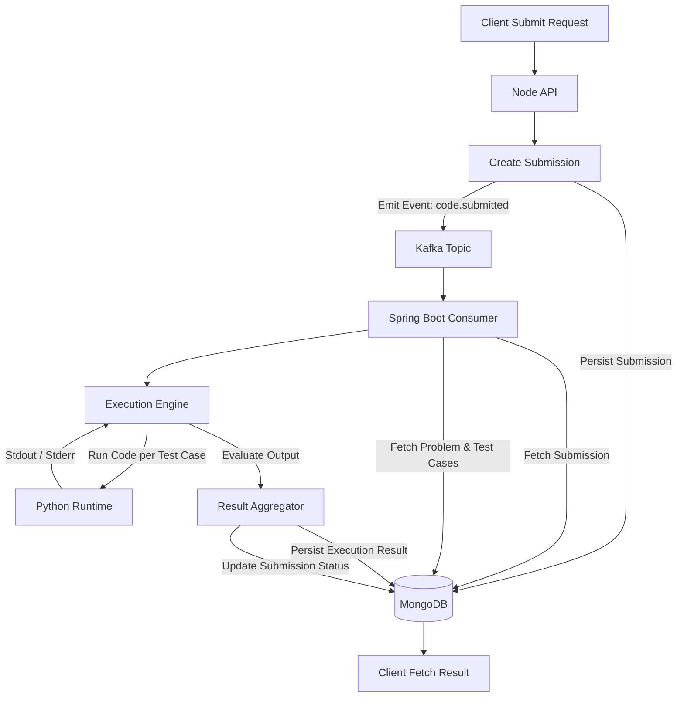

# 🚀 Distributed Code Execution & Evaluation Engine

A scalable, event-driven backend system that executes and evaluates user-submitted code against multiple test cases — inspired by platforms like **LeetCode** and **HackerRank**.

---

## 🧠 Overview

This project simulates a real-world **online judge system**, supporting:

- Asynchronous code submission processing
- Multi-test-case evaluation
- Event-driven microservices architecture (Kafka)
- Persistent storage using MongoDB
- Language execution (Python supported)

---

## 🏗️ Code Execution Workflow




## 🔄 Workflow

1. User submits code via REST API
2. Submission is stored in MongoDB
3. Event is published to Kafka
4. Spring Boot service consumes event
5. Fetches problem + test cases
6. Executes code against each test case
7. Evaluates output
8. Stores result and updates submission status

---

## ⚙️ Tech Stack

### Backend
- Node.js (API Gateway)
- Spring Boot (Execution Engine)

### Messaging
- Apache Kafka

### Database
- MongoDB

### Execution
- Python (via ProcessBuilder)

---

## 📂 Project Structure

```

node-api/
├── routes/
├── models/
├── kafka/
└── controllers/

code-executor/
├── kafka/
├── services/
├── model/
├── repository/
└── config/
```


---

## 🧾 Data Models

### 🟦 Submission

```json
{
  "_id": "ObjectId",
  "userId": "string",
  "problemId": "string",
  "code": "string",
  "language": "python",
  "status": "PENDING | RUNNING | SUCCESS | FAILED"
}
```

### 🟩 Problem

```json
{
  "title": "Sum of Two Numbers",
  "description": "Add two integers",
  "difficulty": "EASY",
  "tags": ["MATHS"],
  "testCases": [
    {
      "input": "2 3",
      "expectedOutput": "5",
      "isHidden": false
    }
  ]
}
```

### 🟨 ExecutionResult
```json
{
  "submissionId": "string",
  "status": "SUCCESS | FAILED | PARTIAL",
  "testCasesPassed": 2,
  "totalTestCases": 2,
  "error": null
}
```

## 🧪 API Endpoints

### Submit Code

```text
POST /api/submit
```
#### - Request Body
```json
{
  "userId": "661f123abc123abc123abc12",
  "problemId": "PROBLEM_ID",
  "language": "python",
  "code": "a, b = map(int, input().split()); print(a + b)"
}
```

#### Response
```json
{
  "message": "Submission received",
  "submissionId": "..."
}
```


## 🧠 Evaluation Strategy

For each test case:
1. Execute user code in isolated process 
2. Provide input via stdin 
3. Capture stdout and stderr 
4. Normalize output formatting 
5. Compare against expected output


## 📊 Result Classification

| Condition      | Status
|----------------|-------
All Test Passed  | SUCCESS
No Test Passed  | FAILED
Some Test Passed  | PARTIAL


## ⚠️ Challenges Addressed
* Handling blocking stdin in runtime execution 
* Ensuring inter-service data consistency 
* Debugging asynchronous Kafka workflows 
* Managing process lifecycle and output capture 
* Normalizing output across environments


## 🚀 Getting Started

* Prerequisites 
* Node.js 
* Java 21+ 
* Maven 
* MongoDB 
* Docker (for Kafka)


## 🔥 Features

* Event-driven execution pipeline 
* Multi-test-case validation 
* Persistent result tracking 
* Scalable microservice architecture 
* Clean separation of concerns

## ⚡ Future Enhancements
* Time Limit Enforcement (TLE)
* Memory usage tracking 
* Docker-based sandbox execution 
* Multi-language support (Java, C++, Go)
* Rate limiting and submission throttling 
* Execution queue prioritization 
* Monitoring & observability (metrics/logging)


## 👨‍💻 Author
Developed as a backend system design project demonstrating distributed systems, event-driven architecture, and execution engine design.

## 💡 Key Takeaways

* Practical implementation of Kafka-based communication 
* Real-world debugging of async systems 
* Process execution and lifecycle handling 
* Database consistency across services 
* Scalable backend design patterns

## ⭐ Support

If you find this project valuable, consider giving it a ⭐ on GitHub.